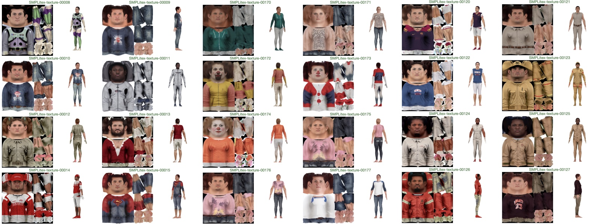

# SMPLitex: A Generative Model and Dataset for 3D Human Texture Estimation from Single Image
<p align="center" width="100%">
	
</p>

British Machine Vision Conference (BMVC), 2023

Dan Casas and Marc Comino-Trinidad

[Project website](https://dancasas.github.io/projects/SMPLitex/index.html)

## Abstract

> We propose SMPLitex, a method for estimating and manipulating the complete 3D appearance of humans captured from a single image. SMPLitex builds upon the recently proposed generative models for 2D images, and extends their use to the 3D domain through pixel-to-surface correspondences computed on the input image. To this end, we first train a generative model for complete 3D human appearance, and then fit it into the input image by conditioning the generative model to the visible parts of subject. Furthermore, we propose a new dataset of high-quality human textures built by sampling SMPLitex conditioned on subject descriptions and images. We quantitatively and qualitatively evaluate our method in 3 publicly available datasets, demonstrating that SMPLitex significantly outperforms existing methods for human texture estimation while allowing for a wider variety of tasks such as editing, synthesis, and manipulation.


## News
Jan 30th, 2024 – Added to [inpaint partial texturemap with Automatic1111](#inpaint-with-automatic1111-best-results) (best results).

Jan 25th, 2024 – Added script to [create partial texture map from image](#generate-partial-texturemap).

## Table of Contents

* [SMPLitex dataset](#SMPLitex-dataset)
* [Results on DeepFashion-MultiModal](#Results-on-DeepFashion-MultiModal)
* [Install instructions](#Install-instructions)
    * [Download pretrained model](#Download-our-pretrained-model)
    * [Train your own model](#Train-your-own-model)    
* [Text to Texture with Diffusers](#Text-to-Texture-with-Diffusers)
* [Text to Texture with Automatic1111](#Text-to-Texture-with-Automatic1111)
* [Texture Estimation from Single Image](#SMPL-Texture-Estimation-from-Single-Image)
  
## SMPLitex dataset
SMPLitex enables the synthesis of textures for SMPL model. For those interested in just accessing to a large number of textures, we have created a curated dataset of SMPL textures generated with SMPLitex. You can access to the dataset here: [Dataset](http://dancasas.github.io/projects/SMPLitex/SMPLitex-dataset.html)

<p align="center" width="100%">
<a href="http://dancasas.github.io/projects/SMPLitex/SMPLitex-dataset.html"></a>
</p>


## Results on DeepFashion-MultiModal
[Results](./results/DeepFashion)

## Install instructions
Please use a UNIX environment. Make sure you have a high-end NVidia GPU. We recommend a RTX 3090 or 4090. 

```bash
pip install -r requirements.txt
```

### Download our pretrained model

Download our pretrained diffuser model from [SMPLitex-v1.0.zip](https://drive.google.com/file/d/1vLLxknRjvQU1oqYha749EYpLPoK1Jn7U/view?usp=sharing) and unzip it `./simplitex-trained-model`

### Train your own model

We fine-tuned a SD v1.4 model. Please be aware that newer or older versions are untested and the pipeline may not work. Create the environment variable as:
 
	export MODEL_NAME="CompVis/stable-diffusion-v1-4"
	
Place your own UV maps in a folder. We used 512x512 pixels .jpg files for our training. We include our training data in "data_train". Create the environment variable pointing to your training data folder, as:

	export INSTANCE_DIR="./data_train"
	
Create a temporary folder onto which to save initial images:

	export CLASS_DIR="class_dir"

	
Set your output model path as:

	 export OUTPUT_DIR="./simplitex-trained-model" 
	
Change your working directory to the scripts folder:

	cd scripts
	
And train your model as:

	accelerate launch --mixed_precision="fp16" train_dreambooth.py   --pretrained_model_name_or_path=$MODEL_NAME    --instance_data_dir=$INSTANCE_DIR   --output_dir=$OUTPUT_DIR   --class_data_dir=$CLASS_DIR   --with_prior_preservation --prior_loss_weight=1.0   --instance_prompt="a sks texturemap"   --class_prompt="a texturemap"   --resolution=512   --train_batch_size=1   --gradient_accumulation_steps=2 --gradient_checkpointing   --learning_rate=1e-6   --lr_scheduler="constant"   --lr_warmup_steps=0   --num_class_images=10   --max_train_steps=1500   --checkpointing_steps=500   --train_text_encoder   --use_8bit_adam  
	
This should train a model for 1500 iterations. Please keep these hyperparameters if you wish to replicate our results.  

## Text to Texture with Diffusers

In the `scripts` folder, we include a Python script for generating texture maps from a text prompt and a pre-trained model. You can check its usage as:

	python text2image.py -h

For example, if you want to generate the UV map of a football player with 75 inference steps, and a guidance scale of 2, and save it in "bill-gates.png":

	python text2image.py --guidance_scale 2 --inference_steps 75 --prompt "a sks texturemap of bill gates" --output_file "bill-gates.png"

This will generate a different image every time, since the seed changes. Below is an example of a texture generated:

<p align="center" width="100%">

</p>

## Text to Texture with Automatic1111

To use [Automatic1111](https://github.com/AUTOMATIC1111/stable-diffusion-webui) with a pre-trained model, please follow their installation instructions. 

If you have trained your own model, you will need to convert it into their format, as follows:

	python scripts/convert_diffusers_to_original_stable_diffusion.py --model_path PATH_TO_YOUR_TRAINED_MODEL  --checkpoint_path OUTPUT_PATH/SMPLitex.ckpt

Alternatively, you can download our pretrained version of SMPLitex directly in the `.ckpt` format from here: [SMPLitex-v1.0.ckpt](https://drive.google.com/file/d/1MMqosTOa-lvl5EOjK2aqAhPBL8p7UzGp/view?usp=sharing)

Finally, move `SMPLitex-v1.0.ckpt` into `models/Stable-diffusion/` in your Automatic1111 installation folder, and select this model on Checkpoints in their web UI.

<p align="center" width="100%">

	
(This example was generated with the settings: Steps: 20, Sampler: Euler a, CFG scale: 2.5, Seed: 1415968941, Size: 512x512, Model hash: a942f240)
</p>


For best results, please use a guidance scale of 2, 50-150 inference steps. An example prompt that generates a UV map of is "a sks texturemap of bill gates".

## SMPL Texture Estimation from Single Image

### Generate partial texturemap

To generate the SMPL texture from photo, first you need to run DensePose to estimate pixel-to-surface correspondences of the subject. Download [Detectron2](https://github.com/facebookresearch/detectron2) and run the following script. This will generate, for each image in the `./dummy_data/images` directory, the corresponding DensePose image and save it under `./dummy_data/images_densepose`:

    cd scripts
    python image_to_densepose.py --detectron2 DETECTRON_PATH --input_folder ./dummy_data/images

Now you will need to compute the silhouette of the subject in the input image. We recommend using [Semantic Guided Human Matting (ACCV 2022)](https://github.com/cxgincsu/SemanticGuidedHumanMatting). Download their [code](https://github.com/cxgincsu/SemanticGuidedHumanMatting), and [weights](https://drive.google.com/drive/folders/15mGzPJQFEchaZHt9vgbmyOy46XxWtEOZ) and run the follwing script. This will generate, for each image in the `./dummy_data/images` directory, the corresponding image mask, and save it under `./dummy_data/images-seg`

	python SemanticGuidedHumanMatting/test_image.py --images-dir ./dummy_data/images --result-dir ./dummy_data/images-seg --pretrained-weight pretrained/SGHM-ResNet50.pth

Finally, you can create the partial texturemaps running the following script. Texturemaps will be saved in `./dummy_data/uv-textures`. Additionally, it will generate a debug visualization in `./dummy_data/debug` and a UV mask of the visible pixels (required for inpaiting later) in `./dummy_data/uv-textures-masks`.

	python compute_partial_texturemap.py --input_folder ./dummy_data


### Inpaint with Automatic1111 (best results)

Make sure you have an Automatic1111 installation up and running. You will also need this [API client for AUTOMATIC1111/stable-diffusion-webui](https://github.com/mix1009/sdwebuiapi)

    $ pip install webuiapi

Launch Automatic1111 on your terminal with API flag.

    ~/stable-diffusion-webui$ ./webui.sh --disable-safe-unpickle --api

Then, make sure you load the SMPLitex model in Automatic1111 web interface, via http://127.0.0.1:7860

Finally, run the following script. Please note that the folder `./uv-textures` and `./uv-texturesmask` contains the partial textures and the masks, respectively, [as explained above](#Generate-partial-texturemap).

    python inpaint_with_A1111.py --partial_textures ./uv-textures --masks ./uv-textures-masks --inpainted_textures `./uv-textures-inpainted`

Inpainted textures will be in `./uv-textures-inpainted`

### Inpaint with Diffusers (experimental)

The results of the paper were generated using our Automatic1111 pipeline. Nonetheless, we have exported the model to Diffusers, which also implements an inpaiting functionality. You can test it following this instructions but, please, notice that this will generate results different than what is reported in the paper. You will need to have a SMPLitex pre-trained model, an image containing the incomplete UV texture, and the mask. Use the following script:

	python inpaint.py --guidance_scale 2.5 --inference_steps 250 --model_path "simplitex-trained-model" --output_folder "output"
	
You can use `--render True` to launch front and back renders of the generated texture using a t-pose SMPL avatar. You may deactivate the post-inpainting refinement using `--refine False`, but results will be hindered. You may also change the prompt or the guidance scale. For more information please use the `--h` option. 


## Citation

```
@inproceedings{casas2023smplitex,
    title = {{SMPLitex: A Generative Model and Dataset for 3D Human Texture Estimation from Single Image}},
    author = {Casas, Dan and Comino-Trinidad, Marc},
    booktitle = {British Machine Vision Conference (BMVC)},
    year = {2023}
}
```
