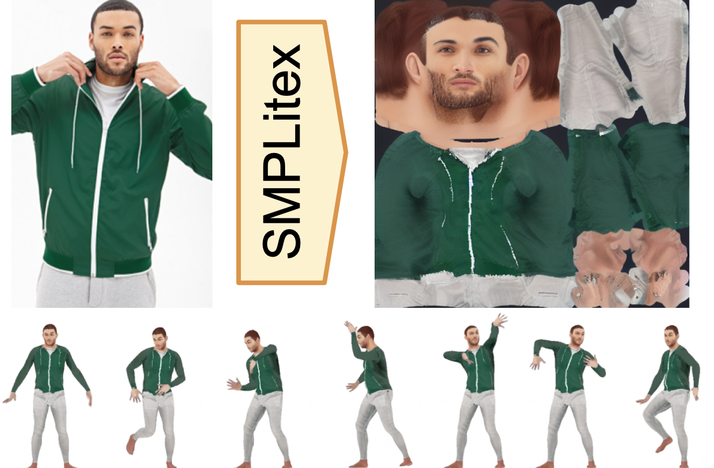
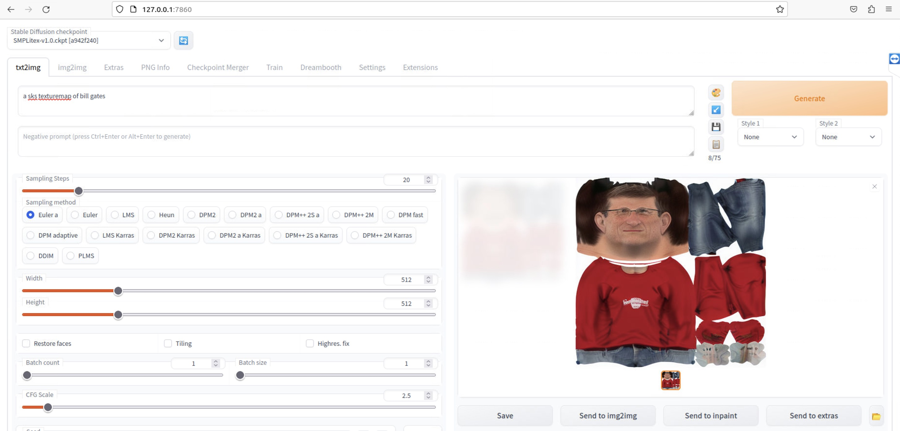

# SMPLitex: A Generative Model and Dataset for 3D Human Texture Estimation from Single Image
<p align="center" width="100%">
	
</p>
[[Project website](https://dancasas.github.io/projects/SMPLitex/index.html)]

## Abstract

> We propose SMPLitex, a method for estimating and manipulating the complete 3D appearance of humans captured from a single image. SMPLitex builds upon the recently proposed generative models for 2D images, and extends their use to the 3D domain through pixel-to-surface correspondences computed on the input image. To this end, we first train a generative model for complete 3D human appearance, and then fit it into the input image by conditioning the generative model to the visible parts of subject. Furthermore, we propose a new dataset of high-quality human textures built by sampling SMPLitex conditioned on subject descriptions and images. We quantitatively and qualitatively evaluate our method in 3 publicly available datasets, demonstrating that SMPLitex significantly outperforms existing methods for human texture estimation while allowing for a wider variety of tasks such as editing, synthesis, and manipulation.

## SMPLitex dataset
SMPLitex enables the synthesis of textures for SMPL model. For those interested in just accessing to a large number of textures, we have created a curated dataset of SMPL textures generated with SMPLitex. You can access to the dataset here: [Dataset](./textures)

Please note that is dataset is under construction and growing. Feel free to send your best samples into SMPLitex dataset via Pull Request!

## Results on DeepFashion-MultiModal
[Results](./results/DeepFashion)

## Install instructions
Please use a UNIX environment. Make sure you have a high-end NVidia GPU. We recommend a RTX 3090 or 4090. 

```bash
pip install -r requirements.txt
```

### Download our pretrained model

Download our pretrained diffuser model from [SMPLitex-v1.0.zip](https://drive.google.com/file/d/1vLLxknRjvQU1oqYha749EYpLPoK1Jn7U/view?usp=sharing) and unzip it "./simplitex-trained-model"

### Train your own model

We fine-tuned a SD v1.4 model. Please be aware that newer or older versions are untested and the pipeline may not work. Create the environment variable as:
 
	export MODEL_NAME="CompVis/stable-diffusion-v1-4"
	
Place your own UV maps in a folder. We used 512x512 pixels .jpg files for our training. We include our training data in "data_train". Create the environment variable pointing to your training data folder, as:

	export INSTANCE_DIR="./data_train"
	
Create a temporary folder onto which to save initial images:

	export CLASS_DIR="class_dir"

	
Set your output model path as:

	 export OUTPUT_DIR="./simplitex-trained-model" 
	
Change your working directory to the scripts folder:

	cd scripts
	
And train your model as:

	accelerate launch --mixed_precision="fp16" train_dreambooth.py   --pretrained_model_name_or_path=$MODEL_NAME    --instance_data_dir=$INSTANCE_DIR   --output_dir=$OUTPUT_DIR   --class_data_dir=$CLASS_DIR   --with_prior_preservation --prior_loss_weight=1.0   --instance_prompt="a sks texturemap"   --class_prompt="a texturemap"   --resolution=512   --train_batch_size=1   --gradient_accumulation_steps=2 --gradient_checkpointing   --learning_rate=1e-6   --lr_scheduler="constant"   --lr_warmup_steps=0   --num_class_images=10   --max_train_steps=1500   --checkpointing_steps=500   --train_text_encoder   --use_8bit_adam  
	
This should train a model for 1500 iterations. Please keep these hyperparameters if you wish to replicate our results.  

## Text To Texture with Diffusers

In the ´script´ folder, we include a file for generating texture maps from a text prompt and a pre-trained model. You can check its usage as:

	python text2image.py -h

For example, if you want to generate the UV map of a football player with 75 inference steps, and a guidance scale of 2, and save it in "bill-gates.png":

	python text2image.py --guidance_scale 2 --inference_steps 75 --prompt "a sks texturemap of bill gates" --output_file "bill-gates.png"

This will generate a different image every time, since the seed changes. Below is an example of a texture generated:

<p align="center" width="100%">

</p>

## Text to Texture with Automatic1111

To use [Automatic1111](https://github.com/AUTOMATIC1111/stable-diffusion-webui) with a pre-trained model, please follow their installation instructions. 

If you have trained your own model, you will need to convert it into their format, as follows:

	python scripts/convert_diffusers_to_original_stable_diffusion.py --model_path PATH_TO_YOUR_TRAINED_MODEL  --checkpoint_path OUTPUT_PATH/SMPLitex.ckpt

Alternatively, you can download our pretrained version of SMPLitex directly in the `.ckpt` format from here: [SMPLitex-v1.0.ckpt](https://drive.google.com/file/d/1MMqosTOa-lvl5EOjK2aqAhPBL8p7UzGp/view?usp=sharing)

Finally, move `SMPLitex-v1.0.ckpt` into `models/Stable-diffusion/` in your Automatic1111 installation folder, and select this model on Checkpoints in their web UI.

<p align="center" width="100%">

	
(This example was generated with the settings: Steps: 20, Sampler: Euler a, CFG scale: 2.5, Seed: 1415968941, Size: 512x512, Model hash: a942f240)
</p>


For best results, please use a guidance scale of 2, 50-150 inference steps. An example prompt that generates a UV map of is "a sks texturemap of bill gates".

## Texture Estimation from Single Image

TODO


## Citation

```
@inproceedings{casas2023smplitex,
    title = {{SMPLitex: A Generative Model and Dataset for 3D Human Texture Estimation from Single Image}},
    author = {Casas, Dan and Comino-Trinidad, Marc},
    booktitle = {British Machine Vision Conference (BMVC)},
    year = {2023}
}
```
